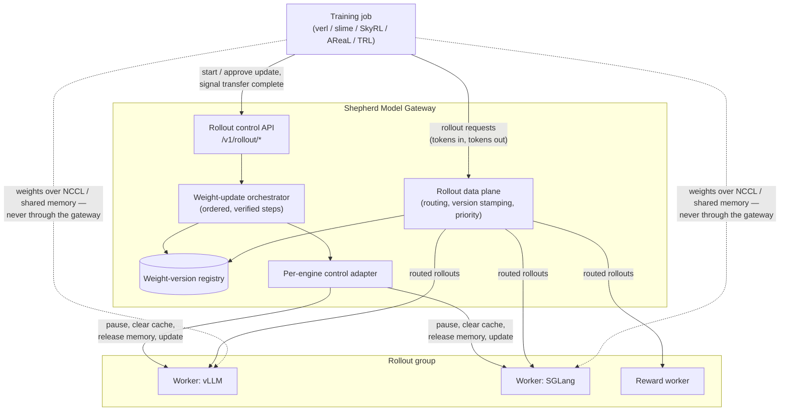
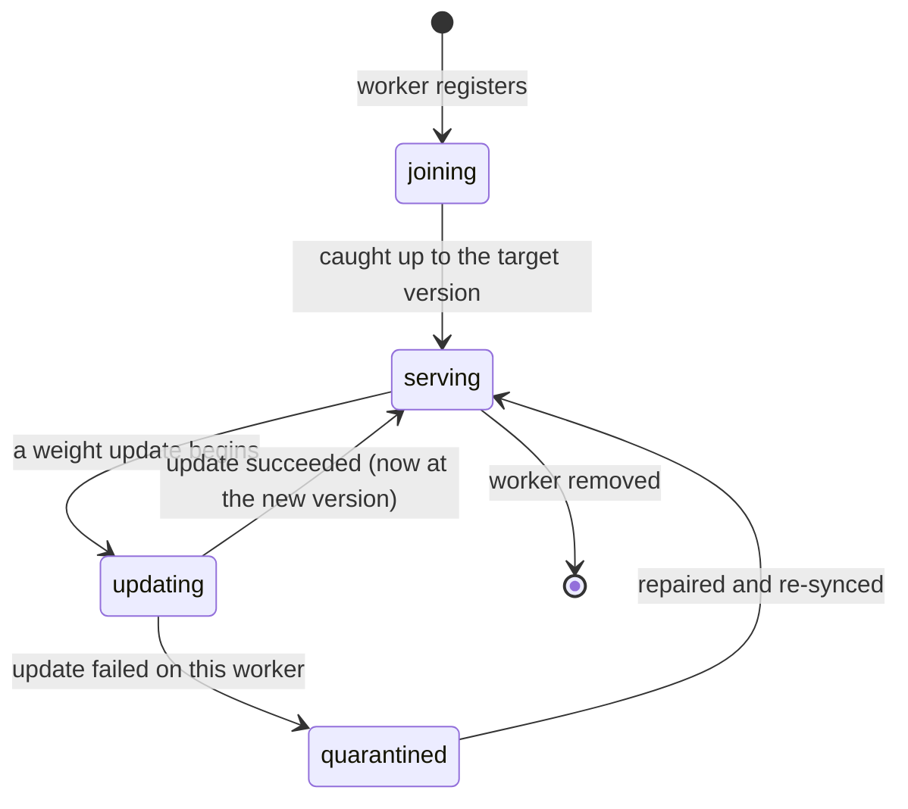
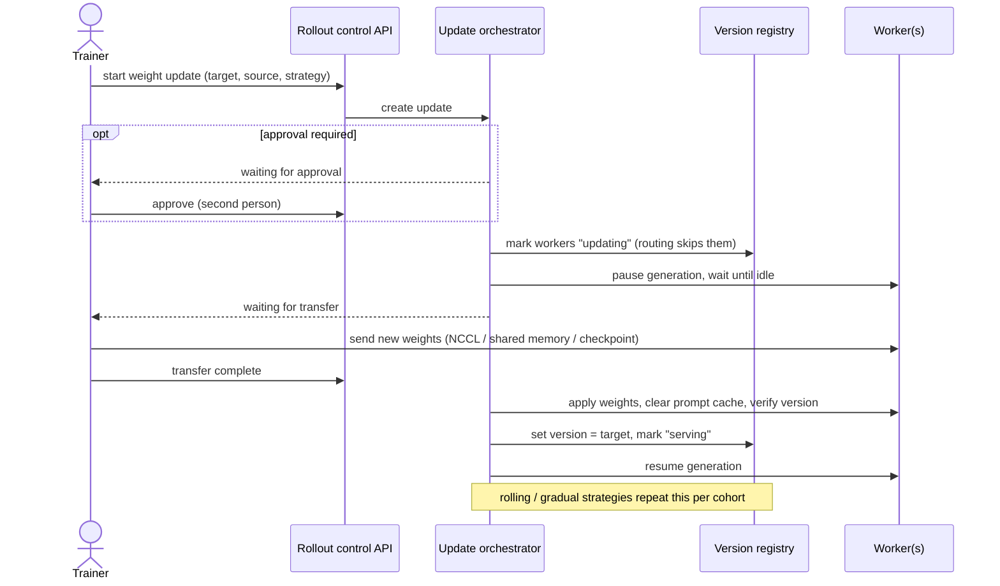
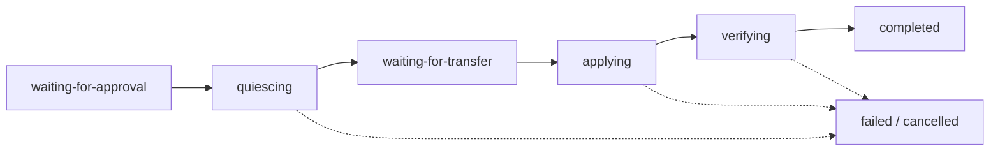

# RFC 0001: Cross-Engine RL Rollout Control Plane

- **Status**: Draft
- **Created**: 2026-07-18
- **Scope**: model_gateway, crates/grpc_client, crates/protocols, crates/workflow, crates/data_connector, crates/auth, crates/mesh
- **Validation**: all load-bearing engine/framework/competitive/codebase claims
  adversarially verified against primary sources on 2026-07-18 (see
  §Validation status).

## Summary

Make SMG the neutral, engine-agnostic control plane for reinforcement-learning
rollout generation across mixed vLLM / SGLang / TensorRT-LLM / TokenSpeed fleets.

Concretely, SMG gains:

1. **Fleet control verbs** — gateway-native, fanned-out, correctly sequenced
   `abort / pause / continue / sleep / wake / flush / update-weights`
   orchestration over heterogeneous engines, exposed as admin APIs and driven
   by the existing DAG workflow engine.
2. **A weight-version registry** — first-class tracking of which policy
   version each worker (and each response) was served from, with
   version-consistent routing, drain-and-flip weight updates, and staleness
   metadata that trainers can use for importance-sampling correction.
3. **Rollout data-plane guarantees** — token-in/token-out fidelity, sampled
   logprobs, partial-output-on-abort semantics, and MoE expert-routing
   passthrough, verified per engine.
4. **Framework adapters** — drop-in integration with slime, verl, TRL, SkyRL,
   and AReaL through their existing extension seams, plus reward-model worker
   roles.

## Motivation

### The category exists; the product does not

SGLang documents its Model Gateway as "the recommended control plane for
large-scale RL rollouts," and it is used in production for GLM training via
slime. But a source-level audit (July 2026) shows the orchestration story is
thinner than the positioning:

- The gateway has **no fan-out** for `update_weights_*`, `pause_generation`,
  `continue_generation`, `release/resume_memory_occupation`, or
  `abort_request`. The issue asking for gateway-level abort
  ([sglang#6531](https://github.com/sgl-project/sglang/issues/6531)) has been
  open since May 2025.
- slime implements drain client-side: it lists workers through the router,
  then **bypasses the router** to call `/abort_request {"abort_all": true}`
  on each engine in a 3-second polling loop — with a vendored "double abort"
  patch because a single abort races in-flight requests.
- Control verbs are hazardous when load-balanced naively: SGLang hit exactly
  this bug class *inside a single server* — `pause_generation` landing on one
  tokenizer worker and `continue_generation` on another left 1/8 of workers
  paused ([sglang#21235](https://github.com/sgl-project/sglang/issues/21235);
  fixed by server-internal broadcast, **not** by gateway fan-out — the fleet-
  level version of the problem remains unowned).
- `weight_version` is a passive label emitted as `system_fingerprint`.
  Nothing prevents mixed-version rollouts mid-update, and nothing routes or
  quarantines by version (verified: zero references in the gateway's policy
  code).
- The gateway recently gained vLLM gRPC worker support for *serving* — but
  it exposes **no RL control endpoints for any backend**, SGLang included.

Meanwhile the demand side is explicit:

- verl's community has open RFCs for exactly this: a **Trajectory Gateway**
  ([verl#5790](https://github.com/volcengine/verl/issues/5790), with
  implementation redirected to the new `verl-project/uni-agent` repo) and
  RemoteAgentLoop ([verl#5737](https://github.com/volcengine/verl/issues/5737));
  verl's in-house `GlobalRequestLoadBalancer` is a single Ray actor doing
  least-in-flight + sticky LRU — no cache awareness, no PD, no fault tolerance.
- vLLM shipped **native RL APIs** in 2026 (`/pause`, `/resume`, the
  `WeightTransferEngine` endpoint family) and framed them as "a standard
  interface for RL frameworks" — engine-side primitives waiting for a control
  plane.
- SGLang's own 2026 roadmaps commit to "Gateway as the DP scheduler for
  rollout" and a "shared rollout interface" with slime/verl/AReaL — declared
  but unshipped as of July 2026 (roadmap items verified unchecked).
- **NVIDIA Dynamo is the clock on this opportunity**: its RL roadmap
  ([dynamo#9178](https://github.com/ai-dynamo/dynamo/issues/9178)) has
  already shipped a token-in/token-out RL response protocol (June 2026) and
  targets trainer→rollout weight sync via ModelExpress/NIXL plus "RL-aware
  routing" around **August 2026**. Dynamo is NVIDIA-stack-centric; the
  positioning that survives its ship date is SMG's engine-agnosticism,
  version-consistent routing + provenance (on no competitor's roadmap), and
  the enterprise governance story (§Security).
- HuggingFace's survey of 16 RL libraries ("Keep the Tokens Flowing")
  documents fragmentation across all seven design axes — the only de facto
  contract is `(token_ids, logprobs, finish_reason)`, which is insufficient;
  every framework re-implements weight sync, interrupts, and staleness
  bookkeeping against raw engine APIs.

SMG is uniquely positioned: it is already engine-agnostic (HTTP + gRPC clients
for vLLM, SGLang, TRT-LLM, TokenSpeed), already has a DAG workflow engine, a
worker registry with drain semantics, fleet fan-out helpers, cache-aware
routing, and — critically — token-in/token-out with logprobs and
`weight_version` already plumbed end-to-end through `/generate`.

## Customer problems this solves

The customer is the ML-infra team running RL post-training (verl / slime /
SkyRL / AReaL / TRL) on their own GPU fleet. Their two scarce resources are
**GPU-hours** (rollout generation dominates RL step time — published
profiling puts it at **more than 90% of total runtime** in long-tail agentic
RL; APRIL, [arXiv:2509.18521](https://arxiv.org/abs/2509.18521)) and **run
stability** (runs last days to weeks; a hang or silent corruption discovered
late wastes the whole fleet's output). Each problem below is observed in the
wild, with receipts. All claims in this section were adversarially
re-verified against primary sources on 2026-07-18.

### P1. Stop-the-world weight sync wastes the rollout fleet

**Today.** Every training step (or every N steps), the entire rollout fleet
halts for weight sync. The choreography is hand-rolled and serialized: slime
lists workers through the router, then bypasses it to call
`/abort_request` on every engine in a 3-second polling loop until idle —
with a vendored "double abort" patch because one abort races in-flight
requests. verl pauses all replicas fleet-wide. The whole fleet then sits
idle for drain + transfer + flush + resume. The industry knows how big this
tax is: NeMo-RL invested heavily to cut refit from 850s to 51s (16x) on
DeepSeek-V3 (v0.3.0 release notes); Moonshot built checkpoint-engine to
broadcast 1T params fleet-wide in 14–20s. But *transfer* speed is only half
the gap — **drain and re-admission are unmanaged**, and nobody overlaps them
with useful work.

**With SMG.** Update jobs with `rolling` and `blue-green` strategies keep
the fleet generating throughout: fresh rollouts route `latest-only` to
updated workers while stragglers finish on old weights (every response
version-stamped, so the trainer can TIS-correct or mask the stale tail).
The rollout gap shrinks from `fleet_drain + transfer + resume` to
approximately the transfer window of one worker cohort.
**Outcome metric:** rollout-fleet goodput during update windows (target:
>80% of steady-state, vs ~0% today with all-at-once sync).

### P2. Long-tail trajectories starve each step

**Today.** A rollout batch waits on its slowest trajectory; sequence-length
skew means a few 30k-token generations idle the rest of the fleet. The
state-of-the-art mitigation (DAPO-style oversampling + abort, partial
rollouts) exists but is fragile client-side machinery: racy aborts,
per-server polling, and in fully-async modes "the trajectory is re-queued
and starts over" (slime's own TODO) because resume plumbing is missing.

**With SMG.** Verified fleet abort (per-worker confirmation + `wait_idle`),
guaranteed abort-with-partials semantics (contract-tested per engine), and
load-skew-aware policies (least-token-load, bucket) that spread long
sequences instead of piling them on one worker. Resumed partials land as
prefix-cache hits because cache-aware routing sends them where the KV
lives. **Outcome metric:** p95 step time / mean step time ratio; fraction
of aborted-trajectory tokens successfully reused on resume.

### P3. Silent trajectory corruption destabilizes training

**Today.** The nastiest failures are invisible until the loss curve
diverges days in: (a) vLLM's legacy weight-update path **does not flush
prefix cache** — new weights silently reuse old-weight KV; (b) mid-update,
requests land on mixed-version workers with no record of which version
generated which tokens; (c) chat-template retokenization drift breaks
token-level importance sampling (the reason verl/slime docs mandate
token-in/token-out); (d) engine numerics make "on-policy" RL silently
off-policy unless rollout logprobs are captured (the TIS/R3 findings). None
of today's routers prevent or even *label* any of this.

**With SMG.** Prevention where possible, attribution everywhere else:
guaranteed post-update flush with independent confirmation via
`KvCacheCleared` events; version-consistent routing (`latest-only`,
`max-staleness:k`) plus universal per-response version stamping — including
on vLLM and TRT-LLM, which cannot stamp responses themselves; a
contract-tested token-in/token-out + logprob-fidelity data plane; MoE
routed-experts passthrough for R3-style replay. Silent corruption becomes
either impossible or a labeled, correctable property of the data.
**Outcome metric:** zero unattributed-version tokens in any trajectory;
stale-KV incidents = 0 by construction.

### P4. Long runs die from operational fragility

**Today.** Multi-day runs accumulate infrastructure failures: router panic
loops when all workers die (sglang#7028, closed only via a full router
rewrite), workers left half-paused because pause/continue verbs fanned out
inconsistently (sglang#21235), stuck aborts under LoRA and PD
(sglang#29179, #10613), router↔engine 503s surfacing only after 50+ steps
of training (slime#1391 — root-caused to environment-specific IP
resolution, which is precisely the class of deployment fragility a managed
control plane absorbs), verl server-mode hangs (#5815 and the #2618
tracking cluster). Every such event costs the fleet until a human notices.

**With SMG.** Control verbs are worker-addressed with per-worker
verification, retries, and a reconciliation sweep (a fleet can never be
half-paused without the job reporting exactly which workers diverged);
existing circuit breakers, health monitoring, and draining apply to rollout
fleets; failed workers are version-quarantined instead of poisoning the
batch; and elastic replacement is automatic — a fresh worker registering
mid-run is brought to `target_version` (disk or checkpoint-engine P2P)
before it becomes routable. This also unlocks **spot/preemptible GPUs for
rollout capacity**, which no RL stack safely supports today.
**Outcome metric:** MTBF of rollout infrastructure per run; human
interventions per training week; recovery time from worker loss.

### P5. Multi-turn agentic rollouts re-prefill the world

**Today.** Agentic RL (the growth workload: SWE agents, tool-use loops)
re-sends a growing prefix every turn. verl's in-house balancer is
least-in-flight + sticky LRU — no cache awareness, no PD; OpenRLHF shards
round-robin. Measured impact of doing this well (sgl-router cache-aware
benchmark): +92% throughput, cache hit rate 20%→75% — on a synthetic
shared-prefix workload (8×A100, Llama-3.1-8B, DP-8), so treat it as the
best case; real gains depend on prefix-sharing structure.

**With SMG.** Best-in-class cache-aware routing (event-driven precise mode
with per-worker KV block state, approximate radix fallback) plus PD
disaggregation and sticky routing keys applies to rollouts unchanged — an
inherited advantage no RL framework's built-in dispatcher matches.
**Outcome metric:** prefill cache-hit rate and tokens/GPU-hour on
multi-turn rollout workloads.

### P6. One fleet per framework per engine; serving GPUs idle while rollouts queue

**Today.** Rollout plumbing is engine-locked (slime→SGLang; OpenRLHF→vLLM),
so teams cannot mix engines, switch engines without rewriting integration,
or reuse production serving capacity for training. Serving fleets sit at
partial utilization on off-peak hours while rollout jobs wait for dedicated
GPUs (the ROSE paper demonstrates serving clusters can absorb rollout load
SLO-safely, reporting 1.20–3.31x end-to-end throughput vs resource-fixed
baselines — no product supports it).

**With SMG.** One control plane across vLLM/SGLang/TRT-LLM/TokenSpeed; the
same gateway serves production and rollouts with a `rollout` priority class
(preemptible, below interactive SLO traffic) and per-tenant clamps —
opportunistic rollout on idle serving capacity becomes a config, not a
research project. And because training-time scoring and production serving
traverse identical tokenization/parsers/sampling defaults, train/serve
score discrepancies ("it evaluated fine in training") disappear.
**Outcome metric:** aggregate fleet utilization; rollout tokens generated
on otherwise-idle serving capacity; train-vs-serve eval delta.

### North-star metrics for the feature

1. **Rollout goodput during weight-sync windows** (P1) — the headline
   efficiency number.
2. **Tokens/GPU-hour on agentic multi-turn rollouts** (P2, P5).
3. **Unattributed-version tokens per run** (P3) — the headline stability
   number; must be zero.
4. **Human interventions per training week / MTBF** (P4).
5. **Fleet utilization for co-tenant serve+rollout deployments** (P6).

### Why a gateway at all (the "train/serve WYSIWYG" argument)

Routing rollouts and production traffic through the same gateway eliminates
train/serve scoring discrepancies (same tokenization, parsers, sampling
defaults). Beyond that, rollout traffic *needs* the things SMG already does
well — cache-aware routing (multi-turn agentic rollouts re-send growing
prefixes), PD disaggregation, circuit breakers, load skew management for
long-tail sequence lengths — plus the RL-specific control plane this RFC adds.

## Goals

- G1. Gateway-native fleet control verbs with correct sequencing, over HTTP
  and gRPC engines, engine dialect differences abstracted away.
- G2. Weight-update orchestration as first-class workflows: colocated
  (release / restore GPU memory) and dedicated-rollout (pause / transfer /
  resume) sequences,
  including drain-and-flip (rolling, blue/green) update strategies.
- G3. Weight-version registry: per-worker version state, per-response version
  stamping (all engines, not just SGLang), version-consistent routing modes,
  quarantine of stale workers.
- G4. Rollout data-plane guarantees, contract-tested per engine: `input_ids`
  in; `output_ids`, sampled logprobs, `finish_reason=abort` partials,
  `weight_version`, and (where supported) routed experts out.
- G5. Framework adoption seams: slime preset-router drop-in; sgl-router-
  compatible worker CRUD; Python shims for verl `LLMServerClient`, TRL
  `base_url`, SkyRL `remote_inference_engine_urls`, AReaL `InferenceEngine`.
- G6. Reward-model worker role: policy vs reward pools behind one gateway,
  routed and health-checked independently.

## Non-goals

- Moving weight tensors through the gateway. Weights travel over NCCL /
  CUDA-IPC / RDMA between trainer and engines (or via checkpoint-engine). SMG
  sequences and triggers; it never carries tensor payloads.
- Implementing a trainer, reward function, or RL algorithm.
- Replacing checkpoint-engine / Mooncake / NIXL — SMG interoperates with them.
- Trajectory storage and token-faithful trajectory reconstruction from agent
  harness traffic (companion feature; Phase 4 here only reserves the schema
  seam in `data_connector`).

## Background: engine primitives (verified July 2026)

The verbs SMG must orchestrate, per engine. This table is the basis for the
adapter trait in the detailed design.

| Verb | SGLang | vLLM | TRT-LLM |
|---|---|---|---|
| Sleep | `POST /release_memory_occupation {tags:[weights\|kv_cache]}` (needs `--enable-memory-saver`) | `POST /sleep?level=1\|2` (dev mode + `--enable-sleep-mode`) | limited; recent single-rank sleep, treat as coarse |
| Wake (staged) | `POST /resume_memory_occupation {tags}` | `POST /wake_up` with `tags=["weights"]` then `["kv_cache"]` | — |
| Update weights (disk) | `POST /update_weights_from_disk {model_path, weight_version, flush_cache}` | none native (worker-extension only) | refit via orchestrator |
| Update weights (NCCL) | `POST /init_weights_update_group` → `POST /update_weights_from_distributed {names,dtypes,shapes,group_name,weight_version}` → `POST /destroy_weights_update_group` | native: `POST /init_weight_transfer_engine` → `/start_weight_update` → `/update_weights` (chunked) → `/finish_weight_update`; legacy: `collective_rpc("init_weight_update_group"/"update_weight")` | CUDA-IPC via NeMo-RL-style path |
| Update weights (IPC/tensor) | `POST /update_weights_from_tensor {serialized_named_tensors, weight_version}` | `collective_rpc("update_weights_from_ipc_handles")`; native `ipc` backend | `update_weights_from_ipc_handles` |
| Pause / continue | `POST /pause_generation {mode: abort\|retract\|in_place}` / `POST /continue_generation` | `POST /pause?mode=abort\|wait\|keep&clear_cache=` / `POST /resume` | drain via orchestrator |
| Abort requests | `POST /abort_request {rid \| abort_all}` — running requests return partial tokens with `finish_reason=abort` | no public per-request endpoint; disconnect aborts; `/pause?mode=abort` for fleet | engine `Abort` RPC |
| Flush KV | `POST /flush_cache` (auto after weight updates by default) | `POST /reset_prefix_cache` (dev mode; NOT automatic after legacy weight updates) | — |
| Version stamp in responses | yes: `meta_info.weight_version` (+ `GET /get_weight_version`) | **no** — gateway must supply | no — gateway must supply |
| Token-in/token-out + logprobs | `/generate` `input_ids`, `return_logprob`, `output_token_logprobs` (`output_ids` top-level) | `prompt_token_ids` / `return_token_ids`, `logprobs`, `prompt_logprobs` | via gRPC Generate |
| Routed experts (MoE R3) | **mainline since Dec 2025** (`return_routed_experts`, PR #12162) | `TokenOutput.routed_experts` in verl path | — |
| DP rank pinning | `routed_dp_rank` body field | HTTP **header** (router-injected) or per-rank endpoints (external LB) | — |

Key sequencing constraints learned from engine docs and postmortems:

- **vLLM legacy weight path does not invalidate prefix cache.** After
  `collective_rpc` weight updates the gateway must call
  `/reset_prefix_cache`, or new weights serve stale-weight KV. The native
  path (`/finish_weight_update`, `/pause?clear_cache=true`) handles this.
- **Staged wake avoids OOM**: wake weights → transfer → free buffers → wake
  KV. Both engines support tags for exactly this; the gateway must not wake
  both at once on memory-tight colocated setups.
- **Control verbs must never be load-balanced.** They are fleet-scoped or
  worker-scoped, never request-routed (the sglang#21235 split-brain).
- **Partial-rollout resume is client re-issue.** No engine has server-side
  "continue rid". Aborted requests return accumulated tokens; resumption is a
  new `/generate` with `input_ids = prompt + partial`, which radix/prefix
  cache turns into a cheap re-prefill. The gateway's job: return partials
  faithfully, and route the resume where the prefix lives (cache-aware
  routing already does this).

## Background: what frameworks need (verified July 2026)

| Framework | Data plane | Weight sync | Interrupt model | Version/staleness | SMG seam |
|---|---|---|---|---|---|
| **slime** | router `/generate` `{input_ids, return_logprob}`; sticky `X-SMG-Routing-Key` | direct-to-server SGLang verbs, router bypassed | fan-out abort + poll `/v1/loads` until idle | `weight_version` param; off-policy masked or TIS | preset `--sglang-router-ip/port` → SMG drop-in; `/workers` CRUD compat |
| **verl** | `LLMServerClient.generate(prompt_ids) → TokenOutput{token_ids, log_probs, routed_experts, stop_reason}` | `CheckpointEngineManager` (naive/nccl/nixl/delta_sharded) | `pause_generation(mode=abort)` → partials with `stop_reason=aborted` | `set_global_steps` stamped per response; `min/max_global_steps` per trajectory | custom `client_cls` for `LLMServerManager.get_client()` |
| **TRL** | `POST /generate/ {prompts: [[int]]} → {completion_ids, logprobs}` | `/init_communicator/` + `/update_named_param/` + NCCL bcast (client = last rank) | n/a (sync) | none | implement TRL's 9 endpoints; SMG as `vllm_server_base_url` |
| **SkyRL** | data plane behind one `external_proxy_url` (OpenAI chat/completions + Tinker-style `/inference/v1/generate`, `X-Session-ID` affinity) | control plane fanned to `external_server_urls`: `/init_weight_transfer_engine`, `/update_weights`, `/get_world_size` | `/pause?mode=abort\|keep\|wait` + `/resume`; abort returns partials, client stitches (`AccumulatedResponse`) | client-side `weight_version` counter; `max_staleness_steps` | SMG serves both proxy and control URLs; cleanest external seam of all frameworks |
| **AReaL** | `ModelRequest{input_ids} → ModelResponse{output_tokens, output_logprobs, output_versions}`; rid-sticky routing for KV reuse | SGLang verbs with `abort_all_requests: true` (vLLM via patched `/areal_*` endpoints) | pause aborts in-flight; client loop re-issues `input_ids + partial` to the same server | **per-token** `output_versions` (version appended per resume segment); `max_head_offpolicyness` admission formula | implement `RemoteInfBackendProtocol` (~10 pure request/response-mapping functions) against SMG endpoints |
| **OpenRLHF / NeMo-RL** | Ray-actor tensor contracts, no HTTP | NCCL / CUDA-IPC / ZMQ in-process | release / restore memory around steps | trajectory age drop | out of scope v1 (no HTTP seam); revisit via shims |

Common denominator (the "minimal adoptable surface"): tokenized generate with
logprobs and abort-partials; SGLang-dialect weight verbs plus vLLM-native
verbs; sgl-router-compatible worker CRUD; optional/disableable gateway health
checking (slime does its own); reward-model pools as ordinary multi-model
routing.

## Terminology

This document is written for human reviewers. It avoids engine-specific and
vendor-specific words in favor of plain language, and defines every recurring
term here once.

| Term | Meaning |
|---|---|
| **Rollout** | One generation request made during RL training: the model reads a prompt and produces a response (a "trajectory") that the trainer later scores. Rollouts are high-volume and often multi-turn. |
| **Rollout group** | A named set of inference workers that serve one model for one training run. This is the exact resource the API acts on; it is always called a "rollout group" (or just "group") in the design and API sections. The prose sections use the ordinary word "fleet" when they mean "all the workers, taken together" in a casual sense — e.g. "the whole fleet sits idle" — but any managed, named thing is a rollout group. |
| **Worker** | One inference-engine process (vLLM, SGLang, TensorRT-LLM, or TokenSpeed) registered behind the gateway. |
| **In-flight request** | A rollout a worker is generating right now. |
| **Weight version** | A short label identifying which training checkpoint a worker's weights came from (for example `step-4200`). The trainer advances it after every update. |
| **Weight update** | The operation of replacing a group's weights with a newer checkpoint and moving every worker to the new weight version. |
| **Prompt cache** | The per-request state a worker keeps so it does not recompute a prompt prefix it has already processed (an engine's "KV cache"). After a weight change this state is stale and must be cleared, or the new weights would reuse old-weight state — a correctness hazard. |
| **Quiesce** | Bring a worker to a resting state (no in-flight work) so its weights or memory can be changed safely. |

### API naming principles

1. Each endpoint reads like a plain-English instruction — a verb acting on a
   named thing (`.../pause-generation`, `.../clear-cache`).
2. The public API never uses engine-internal words (no "sleep", "flush",
   "collective RPC"). Those are implementation details, mapped per engine
   inside the gateway (see the mapping table in the detailed design, part 1).
3. One concept has exactly one name, and every name appears in the table above.
4. Request and response fields spell out their meaning
   (`in_flight: "cancel-and-return-partial"`), so both a human reviewer and a
   coding assistant can read intent without a lookup.



Five new pieces, all riding existing subsystems:

1. **`EngineControl` adapter** — one set of operations the gateway calls,
   translated to each engine's own request names.
2. **Rollout groups + weight-version registry** — worker groups with roles
   (`policy` / `reward` / `draft`) and a record of every worker's weight version.
3. **Weight-update orchestrator** — ordered, verified update sequences for
   both co-located and dedicated-rollout setups, with three rollout strategies.
4. **Rollout control API** — `/v1/rollout/*` endpoints exposing 1-3.
5. **Data-plane extensions** — universal version stamping, rollout QoS class,
   MoE expert passthrough, contract tests.

## Detailed design

### 1. `EngineControl` trait and adapters

New trait alongside the existing `Worker` admin ops (which already dual-
dispatch HTTP/gRPC for `flush_cache`, `start_profile`, `stop_profile`):

```rust
#[async_trait]
pub trait EngineControl: Send + Sync {
    /// Which of the operations below this engine actually supports.
    /// Probed once, when the worker registers.
    fn capabilities(&self) -> EngineCapabilities;

    // --- generation control ---
    async fn pause_generation(&self, in_flight: InFlightPolicy) -> Result<PauseReport>;
    async fn resume_generation(&self) -> Result<()>;
    async fn cancel_in_flight(&self) -> Result<CancelReport>;   // count + partials preserved
    async fn wait_until_idle(&self, timeout: Duration) -> Result<()>;

    // --- GPU memory (so a co-located trainer can borrow the GPU) ---
    async fn release_gpu_memory(&self, parts: MemoryParts) -> Result<()>;  // weights and/or cache
    async fn restore_gpu_memory(&self, parts: MemoryParts) -> Result<()>;

    // --- prompt cache ---
    async fn clear_cache(&self) -> Result<()>;

    // --- weight update (tensors travel engine<->trainer, never through SMG) ---
    async fn open_weight_channel(&self, rendezvous: &TransferRendezvous) -> Result<()>;
    async fn apply_weights(&self, source: &WeightSource) -> Result<()>;
    async fn finish_weight_update(&self, version: &WeightVersion) -> Result<()>;
    async fn close_weight_channel(&self) -> Result<()>;

    async fn read_weight_version(&self) -> Result<Option<WeightVersion>>;
}
```

The gateway speaks these operations in one vocabulary; each adapter translates
them into its engine's own request names. That translation is what lets a
single API drive four different engines:

| Gateway operation | SGLang | vLLM | TensorRT-LLM |
|---|---|---|---|
| `pause_generation` | `POST /pause_generation` | `POST /pause` | gateway-side drain |
| `resume_generation` | `POST /continue_generation` | `POST /resume` | resume routing |
| `cancel_in_flight` | `POST /abort_request` (all) | client-disconnect abort | `Abort` call |
| `release_gpu_memory` | `POST /release_memory_occupation` | `POST /sleep` | coarse |
| `restore_gpu_memory` | `POST /resume_memory_occupation` | `POST /wake_up` | coarse |
| `clear_cache` | `POST /flush_cache` | `POST /reset_prefix_cache` | — |
| `apply_weights` | `/update_weights_from_{disk,tensor,distributed}` | native weight-transfer endpoints | IPC refit |
| `read_weight_version` | `GET /get_weight_version` | (none — gateway supplies) | (none) |

`InFlightPolicy` chooses what happens to requests that are running when
generation is paused. Each value maps to the engines' own modes:

| `InFlightPolicy` | Meaning | SGLang | vLLM |
|---|---|---|---|
| `cancel-and-return-partial` | end them now; hand callers the tokens produced so far | `abort` | `abort` |
| `wait-for-idle` | let them finish; admit no new work | `retract` | `wait` |
| `freeze-and-resume-later` | freeze in place; continue exactly where they stopped after resume | `in_place` | `keep` |

Adapters:

- **SGLang adapter** — every operation maps to a native endpoint (or its gRPC
  equivalent where the servicer exposes one). `finish_weight_update` mostly
  verifies, since SGLang clears its prompt cache automatically after an update.
- **vLLM adapter** — prefers vLLM's built-in RL endpoints when present; where it
  must use development-mode endpoints instead, `finish_weight_update` always
  clears the prompt cache, because vLLM's older weight path does not do so on
  its own (a well-known correctness trap). `capabilities()` records which path
  is active so operators can see it.
- **TensorRT-LLM adapter** — coarse-grained: `pause_generation(wait-for-idle)`
  is done by the gateway (stop routing, wait until idle); weight updates are
  handed to TensorRT-LLM's own orchestrator. `capabilities()` reports what is
  missing so the orchestrator degrades gracefully.
- **TokenSpeed adapter** — co-designed with the engine team; the opportunity to
  expose the full operation set cleanly over gRPC from the start.

Generation-control and weight operations are **addressed to specific workers,
never load-balanced**. Whole-group scope is achieved by explicit fan-out (the
existing `admin_fan_out` helper), with a success/failure result recorded for
each worker.

### 2. Rollout groups and the weight-version registry

**Worker roles.** A worker in a group has a role: `policy` (generates
rollouts), `reward` (scores them), or `draft` (assists speculative decoding).
Reward workers are ordinary multi-model routing under their own model name; the
role simply lets an operator scope an operation ("pause only the policy
workers") and lets health and circuit-breaker settings differ by role.

**Version registry.** A new `WeightVersionRegistry` records, for each rollout
group, the target weight version and every worker's current version and state.
It is kept in memory and, once the mesh is authenticated (see Security, M6),
shared across gateway nodes.

```json
{
  "group": "policy-qwen3-run42",
  "target_weight_version": "step-4200",
  "workers": [
    { "worker": "http://gpu1:8000", "weight_version": "step-4200", "state": "serving" },
    { "worker": "http://gpu2:8000", "weight_version": "step-4100", "state": "updating" }
  ],
  "history": [
    { "weight_version": "step-4200", "promoted_by": "run42-trainer",
      "checkpoint_digest": "sha256:...", "started_at": "...", "completed_at": "...",
      "strategy": "rolling", "outcome": "completed" }
  ]
}
```

A worker moves through these states during its life in a group:



- **Where the version lives.** Each worker's version is stored in its
  `weight_version` label (already read when routing). All changes go through
  the registry so they happen atomically with routing changes. The registry
  updates the label through the internal `register_or_replace` path (which
  preserves in-flight state), never through the user-facing worker-edit path —
  that path rebuilds the model's cache-aware routing tree and would discard
  prompt-cache locality on every update.
- **Version-aware routing.** A group chooses how strict it is about which
  version may serve a request. The choice is a group setting, overridable per
  request with the `X-Rollout-Weight-Version` header:
    - `any` — any healthy worker, regardless of version (today's behavior).
    - `latest-only` — only workers already at the target version; during an
      update, lagging workers are simply not chosen.
    - `pinned` — a specific version, for reproducing an evaluation.
    - `within-staleness-limit` — workers no more than N versions behind the
      target (N is a group setting); if none qualify, the request waits briefly
      or is refused with a "try again shortly" response.
- **Universal version stamping.** Every response carries the weight version that
  produced it — including responses from vLLM and TensorRT-LLM, which do not
  report a version themselves. Because the gateway is the only component that
  sees both the routing decision and the response, it is the only place this
  stamp can be added reliably. When an engine does report its own version
  (SGLang), the gateway cross-checks it and flags any disagreement.

### 3. Weight-update orchestration

A weight update is a short, ordered sequence the gateway runs as a workflow
(built on SMG's existing step engine). The gateway sequences and verifies the
steps; it never carries weight tensors — those move directly between the trainer
and the workers over NCCL, shared memory, or a checkpoint store.

The sequence for one group (or one cohort of a rolling update):



For a co-located setup (the trainer shares the same GPUs), two extra steps
bracket the transfer: before it, the workers **release GPU memory** so the
trainer's step can use the GPU; after it, they **restore GPU memory** in two
stages — weights first, then prompt cache — to avoid running out of memory.

**Update strategies.** How much of the group is taken offline at once:

| Strategy | What happens | Rollout availability | When to use |
|---|---|---|---|
| `all-at-once` | the whole group stops, updates, then resumes | none during the update | small groups; simplest; matches what teams hand-roll today |
| `rolling` | a few workers at a time (`workers_at_a_time`) | continuous | the default for large groups; brief, bounded version spread across workers |
| `gradual-cutover` | both versions serve at once; new rollouts prefer the new version while the old one drains | continuous, with no version mixing inside a single request | when fresh rollouts should start on new weights immediately and running two versions briefly is acceptable |

With `rolling` and `gradual-cutover`, workers legitimately sit at different
versions for a while — which is exactly why version stamping and version-aware
routing exist, and why `within-staleness-limit` lets the trainer bound how far
behind a served request may be.

The partial-rollout case: if the update quiesces with
`in_flight: "cancel-and-return-partial"`, in-progress rollouts return the tokens
generated so far; the trainer's client resubmits them, and cache-aware routing
places the continuation on a worker that already holds the prefix. The gateway
does not store rollout state itself in v1 (see Risks).

**Failure handling:**

- Any step failure → worker goes `Failed` + version-quarantined (never
  routable at `latest-only`), workflow continues with the rest, terminal
  report lists per-worker outcomes. This mirrors and fixes the slime
  pain points (no more whole-group stuck-paused states: pause and resume are
  issued and *verified* per worker, with retries and a reconciliation sweep).
- `KvCacheCleared` events (already consumed by `KvEventMonitor`) are used as
  independent confirmation that a worker's cache actually flushed during an
  update; the kv_index for that worker is reset at the same point, keeping
  cache-aware routing truthful across the flip.
- Elastic join: a worker registering mid-training gets `Pending` +
  registry-version `unknown` → workflow step can trigger
  `update_weights_from_disk` (or checkpoint-engine P2P) to bring it to
  `target_version` before it becomes `Ready`. This is the checkpoint-engine
  interop point: SMG triggers `ParameterServer.update(ranks=[...])`-style
  joins; it never moves tensors.

### 4. Rollout control API

Everything is under `/v1/rollout/` and requires control-plane authentication
with the RL capabilities defined in Security (M1). Names are chosen to read as
instructions; every noun is defined in Terminology.

**Rollout groups**

| Method and path | Purpose |
|---|---|
| `POST /v1/rollout/groups` | Create a rollout group from a list of workers or a label selector. |
| `GET /v1/rollout/groups` | List groups. |
| `GET /v1/rollout/groups/{group}` | Read a group's status, including each worker's weight version and state. |
| `DELETE /v1/rollout/groups/{group}` | Remove the group (the workers themselves stay registered). |

**Generation control** (applied to every worker in the group, then verified per worker)

| Method and path | Purpose |
|---|---|
| `POST /v1/rollout/groups/{group}/pause-generation` | Stop scheduling new rollouts; choose what happens to in-flight ones. |
| `POST /v1/rollout/groups/{group}/resume-generation` | Resume scheduling. |
| `POST /v1/rollout/groups/{group}/cancel-in-flight` | End in-flight rollouts now; partial output is returned to callers. |
| `POST /v1/rollout/groups/{group}/release-gpu-memory` | Have workers free GPU memory (weights and/or prompt cache) for a co-located trainer. |
| `POST /v1/rollout/groups/{group}/restore-gpu-memory` | Reverse of release. |
| `POST /v1/rollout/groups/{group}/clear-cache` | Clear the prompt cache across the group. |

**Weight updates**

| Method and path | Purpose |
|---|---|
| `POST /v1/rollout/groups/{group}/weight-updates` | Start a weight update; returns an `update_id`. |
| `GET /v1/rollout/weight-updates/{update}` | Read progress: phase and per-worker outcome. |
| `POST /v1/rollout/weight-updates/{update}/approve` | Grant the second-person approval, when the update requires one. |
| `POST /v1/rollout/weight-updates/{update}/transfer-complete` | The trainer signals it has finished sending the new weights. |
| `POST /v1/rollout/weight-updates/{update}/cancel` | Stop the update and return the group to a consistent state. |
| `GET /v1/rollout/groups/{group}/weight-version-history` | Who promoted which version, when, and from which checkpoint. |

**One rollout at a time**

| Method and path | Purpose |
|---|---|
| `POST /v1/rollout/requests/{request-id}/cancel` | Cancel a single in-flight rollout by id, where the engine supports it. |

**Request shapes.** The fields a human — or a coding assistant — fills in:

Create a group:

```json
{
  "name": "policy-qwen3-run42",
  "model": "qwen3-8b",
  "role": "policy",
  "members": { "worker_urls": ["http://gpu1:8000", "http://gpu2:8000"] },
  "weight_version_routing": "latest-only"
}
```

Pause generation:

```json
{ "in_flight": "cancel-and-return-partial" }
```

Start a weight update:

```json
{
  "target_weight_version": "step-4200",
  "weight_source": "training-broadcast",
  "update_strategy": "rolling",
  "workers_at_a_time": 2,
  "in_flight": "cancel-and-return-partial",
  "provenance": { "checkpoint_digest": "sha256:...", "signature": "..." },
  "requires_approval": true
}
```

`weight_source` says where the new weights come from:

| Value | Meaning |
|---|---|
| `checkpoint-path` | Workers load the weights from a file path or object store (add `checkpoint_path`). |
| `training-broadcast` | The trainer broadcasts weights over NCCL; the gateway opens the channel and assigns each worker its rank (add `training_process` with the rendezvous host, port, and world size). |
| `shared-memory` | Trainer and worker share a GPU; weights pass by handle, with no copy (co-located setups). |
| `trainer-managed` | The trainer moves the weights entirely on its own; the gateway only quiesces, verifies, and flips the version around a window the trainer opens and closes. This is the lowest-trust option and the easiest to adopt first. |

The start-update response and the status endpoint share one shape:

```json
{
  "update_id": "upd_01H...",
  "group": "policy-qwen3-run42",
  "target_weight_version": "step-4200",
  "strategy": "rolling",
  "phase": "waiting-for-transfer",
  "worker_ranks": { "http://gpu1:8000": 1, "http://gpu2:8000": 2 },
  "workers": [
    { "worker": "http://gpu1:8000", "weight_version": "step-4200", "state": "serving" },
    { "worker": "http://gpu2:8000", "weight_version": "step-4100", "state": "updating" }
  ],
  "approval": { "required": true, "granted_by": "alice@corp", "granted_at": "..." }
}
```

An update moves through a fixed set of phases, which the trainer can poll or
receive by webhook:



Design notes:

- Updates run on SMG's existing background-job and workflow machinery; progress
  comes from the workflow's own step events.
- For `training-broadcast`, the gateway computes each worker's rank and returns
  the assignment, so the trainer does not have to — every framework hand-writes
  this today.
- `trainer-managed` is the minimal-trust entry point: the gateway sequences and
  verifies but touches none of the transfer mechanics.
- Per-rollout cancel closes a gap frameworks ask for today (they can currently
  cancel only a whole replica).

### 5. Data-plane extensions

- **Rollout QoS**: map RL traffic to the existing priority scheduler's
  **`Bulk` class** (already below `Default`), with rollout tenants clamped
  via existing `TenantPolicy`, so co-tenant serving+rollout fleets
  (ROSE-style) keep SLO traffic first. We deliberately do NOT add a new
  `Class` variant: the per-class inflight accounting packs exactly four u16
  lanes into one fully-consumed `AtomicU64` (`scheduler/slots.rs`), so a
  fifth class would force a rework of the lock-free admission hot path for
  no semantic gain over `Bulk`.
- **Contract tests per engine** (e2e_test): `input_ids` round-trip fidelity;
  logprob presence/alignment under temperature; abort returns partials with
  correct `finish_reason` and logprobs for generated tokens; version stamp
  present; resume-after-abort lands as cache hit (assert `cached_tokens`).
  These become the advertised "rollout-grade" guarantees, and the retry storm
  tolerance test (slime: 60 retries × 1s, timeout=None) belongs here too.
- **MoE expert-routing passthrough** (`return_routed_experts`): plumb through
  `/generate` and gRPC. Mainline SGLang has supported it since Dec 2025
  (PR #12162), and the gateway-side field-drop bug was fixed in SMG's own
  openai-protocol crate (April 2026) — so chat-completions passthrough
  partially works already; this item is finishing the `/generate` + gRPC
  plumbing and contract-testing it. slime still ships a forked router wheel
  for R3, so a verified mainline path here is an immediate adoption wedge.
- **Sticky routing for multi-turn rollouts**: `X-SMG-Routing-Key` already
  exists (consistent-hashing policy). Document it as the rollout session key;
  cache-aware policy remains the default recommendation.

### 6. Protocol / crate changes

- `crates/protocols`: `WorkerSpec { rl_role }`, `WeightSource`,
  `TransferRendezvous`, `EngineCapabilities`, and the group / update-job
  types; extend `GenerateRequest` with `return_routed_experts`.
- `crates/grpc_client` protos: add `PauseGeneration`, `ResumeGeneration`,
  `ReleaseGpuMemory`, `RestoreGpuMemory`, `ApplyWeights{FromDisk,FromTensor,
  FromDistributed}`, and `OpenWeightChannel` RPCs to `common.proto` /
  per-engine protos,
  implemented first in the SGLang servicer and TokenSpeed (co-design), HTTP
  fallback elsewhere. Note (verified): no engine proto's `GenerateComplete`
  carries `weight_version` — today SMG synthesizes the response stamp from
  worker labels in `dispatch_metadata.rs`, and `weight_version` is available
  via the existing `GetModelInfo` RPC, so no separate `GetWeightVersion` RPC
  is needed. Optionally add `weight_version` to `GenerateComplete` in the
  SGLang/TokenSpeed servicers so per-response engine truth can be
  cross-checked against the label.
- `model_gateway`: `EngineControl` impls on `BasicWorker` (dual dispatch like
  `flush_cache`); `WeightVersionRegistry` (+ mesh adapter — the mesh adapter
  pattern in `mesh/adapters/` has three existing exemplars to follow);
  workflow steps + `create_weight_update_workflow`; `/v1/rollout/*` routes;
  rollout traffic mapped to the existing `Bulk` priority class (see §5);
  version-aware filtering in `get_healthy_worker_indices` (one added
  predicate, policy-agnostic). Version flips MUST go through the registry's
  `register_or_replace` path, not user-facing PATCH — verified: the PATCH
  worker-update workflow re-initializes the model's cache-aware tree
  (`update_policies_for_worker.rs`), which would trash rollout cache
  locality on every weight update.
- `crates/data_connector` (Phase 4 seam only): reserve
  `extra_columns`/hooks-based trajectory columns (`weight_version`, reward,
  token counts) on stored responses.

### 7. Framework adapters (bindings/python + clients/)

Thin shims, in adoption-priority order:

1. **slime** — zero-code path: SMG already accepts sgl-router worker CRUD and
   `/generate`; validate with `--sglang-router-ip/port` pointed at SMG, then
   contribute an optional "gateway-managed update" mode to slime that replaces
   its bypass-and-poll drain with one `/v1/rollout/fleets/{f}/updates` call.
2. **verl** — publish `smg.verl.SmgServerClient` implementing
   `LLMServerClient.generate() -> TokenOutput` (maps `stop_reason`,
   `log_probs`, `routed_experts`, stamps `global_steps` from SMG's version
   registry) for `LLMServerManager.get_client(client_cls=...)`.
3. **TRL** — `smg trl-serve` compatibility surface: the 9 endpoints
   (`/generate/`, `/init_communicator/`, `/update_named_param/`, …) fronting
   an SMG fleet, so `vllm_server_base_url` just points at SMG.
4. **SkyRL** — point `external_proxy_url` at SMG's data plane and
   `external_server_urls` at SMG (which fans control verbs out itself,
   collapsing SkyRL's per-server loop to one target). Note: the older
   `remote_inference_engine_urls` key is removed in current SkyRL main.
5. **AReaL** — contribute an `SmgBackend` implementing
   `RemoteInfBackendProtocol` (~10 pure functions mapping
   generate/pause/resume/weight-update requests to SMG endpoints). AReaL's
   per-token `output_versions` is satisfied by stamping version at dispatch
   and on every resume segment; rid-sticky routing maps to
   `X-SMG-Routing-Key`.
6. **NeMo-RL / OpenRLHF** — explicitly out of scope for v1: their contracts
   are Ray-actor + torch-tensor native (ZMQ/CUDA-IPC refit into engine
   internals), with HTTP only as an environment-facing add-on.

## Enterprise use cases (distinct from open source)

Open-source RL users (labs, framework authors) want raw throughput and control
on a trusted single-tenant network. Enterprise buyers want the same efficiency
*plus* governance, and the research shows they overwhelmingly **buy managed RL
platforms** rather than operate trainer/inference co-scheduling themselves
(CoreWeave Serverless RL, OpenAI/Azure RFT, Fireworks RFT, Predibase, Databricks
TAO, AWS Bedrock/SageMaker RFT). Named enterprise RL outcomes cluster into three
use cases: **agent reliability / tool-use accuracy** (Runloop +12% Stripe-API
codegen, QA Wolf, SquadStack), **expert-graded domain reasoning** (Harvey +20%
legal-citation F1, Accordance +39% tax analysis, Ambience +12pts ICD-10 coding),
and **frontier-quality-at-small-model-cost** (Fireworks/Predibase distillation
cases). SMG's play is the self-hosted control plane underneath these — for
enterprises that cannot send proprietary code, PHI, or regulated data to a SaaS
trainer.

The reframing that matters: **for enterprise, the security gap IS the value
proposition.** The RL substrate (vLLM dev-mode RL endpoints, NCCL,
torch.distributed, Ray) is unauthenticated and unencrypted *by design* — vLLM's
own security docs state inter-node comms are "insecure by default," there is a
CVSS 9.8 RCE precedent (CVE-2025-47277, pickle-over-TCPStore), and ShadowRay is
actively hijacking GPU clusters in the wild. No enterprise can ship this on a
shared network. A control plane that **owns and authenticates the trigger
surface** turns an un-shippable substrate into a governed one. That is the
enterprise answer to "what does SMG bring."

Requirements enterprise RL adds that research setups ignore (prioritized):

**Must design for day one (expensive to retrofit):**

1. **Own/authenticate the weight-transfer + fleet-control trigger surface.**
   Keep engine dev-mode and NCCL/TCPStore rendezvous ports off any routable
   network; SMG brokers the trainer↔engine channel and is the only authorized
   caller. (Core value prop — see §Security M5.)
2. **RBAC with RL-native verbs** mapped to enterprise identity (OIDC/SAML):
   distinct permissions for trigger-weight-update, pause/drain-fleet,
   promote-to-serving, export-weights, register-reward/environment (arbitrary
   code — privileged). SMG's auth is a binary Admin/User toggle today (§Security
   M1).
3. **Immutable, provenance-carrying audit** of every state-changing action —
   simultaneously the security control and the EU AI Act "downstream modifier"
   / NIST AI RMF / SR 11-7 model-risk compliance artifact (§Security M3).
4. **Multi-tenant isolation + accounting** (per-team GPU-time/token chargeback;
   coexistence with an external quota scheduler like Kueue/Run:ai rather than
   owning the cluster). Tenancy boundaries can't be bolted on later (§Security
   M7).
5. **Separate "sync weights to rollout fleet" from "promote checkpoint to
   serving,"** with an eval-gated, approval-gated, rollback-able promotion
   path. RL's continuous weight updates make conflating these dangerous — this
   is a distinct gate from the rollout weight-sync of §3, and the RFC's update
   workflows must not auto-promote a rollout version into production serving.
6. **Self-hostable / air-gap-compatible** control plane, no mandatory outbound
   SaaS dependency.

**Should have early (layerable):** checkpoint signing/verification (OpenSSF
Model Signing + sigstore, already adopted by NVIDIA NGC), trajectory data
governance hooks (retention TTL, PII redaction point, residency pinning),
budget/quota with alerting, model-registry integration (MLflow/W&B/SageMaker)
with promotion-stage metadata.

**Can defer:** SCIM auto-provisioning, FIPS/FedRAMP/HITRUST attestations
(design crypto swappable), GPU-TEE confidential weight transfer (immature —
leave a seam).

## Security and access control

The orchestration design is sound but currently assumes a trusted
single-tenant operator on a trusted network, while simultaneously pitching
untrusted multi-tenant co-tenancy (P6) and exposing the single most dangerous
primitive in ML infra — **arbitrary weight replacement** — behind a boolean.
The amendments below are the day-one constraints that make the co-tenancy and
weight-update stories safe; without them the RFC must scope itself to a single
trust domain on a segmented network.

Ground truth from an audit of SMG's current code (these are real gaps, some
pre-existing bugs):

- Authorization is a **binary global `enum Role { Admin, User }`**
  (`crates/auth/src/config.rs`); every control-plane route gates only on
  `is_admin()`. No per-resource, per-verb, or per-fleet scoping exists.
- Tenancy is **data-plane only** (`tenant.rs`, `tenant_resolution.rs`); admin/
  worker routes receive no tenant resolution — control-plane ops are global.
- Audit (`crates/auth/src/audit.rs`) is a `tracing` log line with outcome
  **`Success | Denied` only**, captures path but not parameters, and cannot
  express weight provenance/lineage or partial-fleet outcomes.
- **Pre-existing bug:** `crates/mesh/src/mtls.rs` builds the TLS config with
  `.with_no_client_auth()` despite `require_client_cert` defaulting true — mesh
  peers are **not** client-authenticated, and cert rotation is a TODO stub.
  This is disqualifying for gossiping a weight-version registry and should be
  fixed independently of this RFC.

### Day-one design constraints (must be in the RFC before Phase 1)

- **M1 — Scoped RL capabilities, not `is_admin()`.** Add capability claims
  `rl:observe` / `rl:operate` (pause / resume / cancel-in-flight /
  release-gpu-memory / restore-gpu-memory / clear-cache) /
  `rl:update-weights` / `rl:promote` / `rl:approve`, each bound to a **fleet
  selector**, enforced by a `check_rl_capability(principal, fleet, verb)` gate
  ahead of every `/v1/rollout/*` handler. Without this, co-tenancy (P6) is a
  privilege-escalation surface.
- **M2 — Provenance-verified, approval-gated weight updates.** `WeightUpdateSpec`
  carries `{artifact_digest, signature, signer_identity}`; SMG verifies bytes
  against the digest and the signature against a configured trust root
  (OpenSSF Model Signing / sigstore / internal KMS), constrained to a
  per-fleet **checkpoint allow-list** of path prefixes / registry URIs. A
  config-selectable **two-person rule** for `method: disk|distributed|external`
  reuses the same barrier mechanism as `transfer-complete` as the `rl:approve`
  join point. This
  turns "arbitrary model replacement" into "verified, allow-listed, dual-
  controlled promotion."
- **M3 — Provenance-carrying, tamper-evident audit.** Extend `AuditEvent` with
  RL fields (`fleet`, `verb`, `target_version`, `source_digest`, `strategy`,
  `per_worker_outcomes`, `approval_ref`) and outcomes `{Error, Partial}`;
  persist version **lineage** in the registry history
  (`{version, digest, signer, promoted_by, approved_by, timestamps, strategy,
  outcome}`); emit to an append-only / hash-chained sink or SIEM, not only a
  log line. This is the EU AI Act / NIST / SR 11-7 evidence artifact.
- **M4 — Network trust model + no cross-tenant rendezvous.** Document that the
  training/transfer plane MUST be a segmented VLAN/namespace; NCCL is
  unauthenticated/unencrypted and MUST NOT traverse shared networks. SMG
  **refuses to compute or distribute a rendezvous whose members span more than
  one tenant/fleet-owner**, validates every worker in a `distributed` job
  against the caller's fleet scope (ties to M1), and binds `rank_offset` to an
  authenticated worker identity, not just an address.
- **M5 — SMG as sole authorized caller of engine control ports.** When vLLM
  `VLLM_SERVER_DEV_MODE` / `collective_rpc` paths are enabled (near-RCE), the
  RFC *mandates* (not advises): engine control endpoints reachable only from
  the gateway (NetworkPolicy/firewall/mesh-only), mTLS on the SMG→engine hop
  with the engine rejecting non-SMG callers, direct external engine access
  disabled. Prefer the native RL API path; treat legacy `collective_rpc` as
  opt-in with an explicit near-RCE warning.
- **M6 — Authenticate the mesh before syncing the registry.** Fix
  `mtls.rs` to install a `ClientCertVerifier` honoring `require_client_cert`;
  require authenticated peer identity and sign registry CRDT entries so one
  compromised node cannot forge fleet-wide version state via gossip. Until
  mesh mutual auth is real, the registry is **single-writer-authoritative**,
  not gossip-converged.
- **M7 — Tenant-scoped control-plane objects.** Every fleet / version /
  update-job / trajectory has an owning tenant; `/v1/rollout/*` gets tenant
  resolution (today no tenant middleware touches admin routes); audit and
  version views are per-tenant partitioned; trajectory columns carry the
  owning tenant and enforce read authz. If deferred, the RFC must state that
  serve+rollout co-tenancy across **distinct trust domains** is out of scope
  for v1 (same-tenant co-tenancy only).
- **M8 — Cross-tenant prefix-cache side-channel isolation.** Automatic prefix
  caching is a published TTFT timing side channel that lets a co-tenant
  reconstruct another tenant's prompt token-by-token
  ([arXiv:2508.08438](https://arxiv.org/abs/2508.08438),
  [arXiv:2603.10726](https://arxiv.org/html/2603.10726v1)), and a high-volume
  rollout tenant is the ideal adversary. When a `Bulk`-class rollout tenant
  shares a fleet with SLO serving tenants, prefix/radix reuse MUST be
  partitioned per tenant for any tenant marked sensitive; add per-tenant
  KV/cache quotas so rollout cannot evict/starve serving; and ensure the
  `cached_tokens` field (used in our own contract tests) is not an oracle
  across tenant boundaries. Default co-tenant deployments to cache isolation;
  make sharing opt-in per trust domain.

### Phase 2+ hardening

API-key lifecycle (expiry/rotation/revocation; short-lived JWTs for
operators); rate-limit / precondition-token the destructive verbs
(`abort {scope: all}`, fleet sleep, update-weights) so stale/replayed calls
can't nuke a fleet; promote the `weights_checker` sentinel-hash probe from
stretch to standard post-update verification; real mesh cert rotation +
SPIFFE-style worker/peer identities; SLSA-style provenance chaining the M2
digest back to the trainer run; per-tenant audit export + trajectory-read
logging; runtime KV side-channel mitigations (SafeKV/CacheSolidarity selective
sharing) beyond M8's default partitioning.

## Rollout plan (phases)

- **Phase 0 — data-plane hardening (small)**: contract tests per engine;
  abort-partials fidelity; routed-experts passthrough; retry-storm tolerance;
  document `X-SMG-Routing-Key` for rollouts. Ships alone as "SMG is
  rollout-grade today."
- **Phase 1 — control verbs + authz foundation (medium)**: `EngineControl`
  trait + SGLang/vLLM adapters; fleet fan-out endpoints
  (pause / resume / cancel-in-flight / release- and restore-gpu-memory /
  clear-cache) with per-worker verification;
  **scoped RL capabilities (M1)** and the **network trust model (M4, M5)**
  land here, not later — they are the gate on exposing any control verb.
  Immediately fixes slime's bypass loop and the sglang#6531/#21235-class
  problems — and works for vLLM fleets, which no router offers.
- **Phase 2 — version registry + update workflows (large)**: registry,
  stamping, version-aware routing, update jobs with all three strategies,
  checkpoint-engine external mode, elastic-join catch-up. **Provenance-verified
  + approval-gated updates (M2), provenance-carrying audit (M3), and the mesh
  auth fix (M6)** are in scope here — the registry must not gossip over the
  current unauthenticated mesh, and weight updates must be governed from the
  first shipped version. Separate the rollout-sync path from a gated
  promote-to-serving path (enterprise req #5).
- **Phase 3 — framework shims + tenancy (medium)**: slime validation + upstream
  PR, verl client (watch `verl-project/uni-agent`), TRL surface, SkyRL/AReaL
  impls; **tenant-scoped control-plane objects (M7) and cache side-channel
  isolation (M8)** land with the multi-tenant story; example configs under
  `examples/rl/`.
- **Phase 4 — trajectory capture (separate RFC)**: rollout trajectory
  storage on the data_connector seam; token-faithful capture from black-box
  agent harnesses (Polar-style); reward joins.

## Competitive positioning

| Capability | SGLang gateway | Dynamo (NVIDIA-stack) | vLLM router / llm-d / AIBrix | verl in-house | **SMG (this RFC)** |
|---|---|---|---|---|---|
| Cross-engine (vLLM+SGLang+TRT+TokenSpeed) | serving only | NVIDIA-centric | no | n/a | **yes** |
| Gateway fan-out control verbs | no (flush only) | roadmap ~Aug'26 | no | no | **yes, verified per worker** |
| Weight-update orchestration | no (client-side) | roadmap ~Aug'26 (NIXL) | no | framework-internal | **yes, 3 strategies, engine-agnostic** |
| Version registry + version-aware routing | no (passive label) | no | no | `global_steps` stamping only | **yes** |
| Universal per-response version stamping | SGLang-only | TITO protocol | no | n/a | **yes, all engines** |
| Abort with partials at gateway | no (open issue) | roadmap ("pause agents") | no | replica-wide only | **yes + per-request where supported** |
| Reward pools behind same gateway | implicit (multi-model) | no | no | separate sglang-router | **first-class role** |
| Serve+rollout QoS co-tenancy | no | no | no | no | **Bulk priority class** |
| Enterprise governance (RBAC/provenance/audit/tenancy) | no | no | no | no | **designed in (§Security)** |

**Shelf life of this table (verified 2026-07-18):** NVIDIA Dynamo's RL
roadmap ([#9178](https://github.com/ai-dynamo/dynamo/issues/9178)) is the
one to watch — it has already shipped a token-in/token-out (TITO) RL
response protocol and ModelExpress model loading, and targets trainer→rollout
weight sync via NIXL plus RL-aware routing around **August 2026**. When that
ships, "nobody orchestrates RL weight updates at the gateway" expires. The
differentiation that outlasts it is the combination no single competitor is
pursuing: **engine-agnostic** (Dynamo is NVIDIA-stack), **version-consistent
routing + weight provenance** (on no competitor's roadmap), and **enterprise
governance** (RBAC, audit, tenancy, checkpoint signing — §Security). The
window to land Phase 1 is roughly two quarters; the RFC is scoped so Phase 0
and Phase 1 deliver standalone value before it closes.

## Risks and open questions

1. **vLLM dev-mode dependency.** Sleep/`collective_rpc`/`reset_prefix_cache`
   sit behind `VLLM_SERVER_DEV_MODE`; the native RL APIs reduce but don't
   eliminate this. Mitigation: capability probing + documented deployment
   flags; track vLLM RFC #48312 correctness fixes and pin known-good
   versions in docs.
2. **Engine API churn.** These surfaces are young (vLLM native APIs 2026-05;
   SGLang gateway rename churn; TRT-LLM sleep support new). The
   `EngineControl` trait + capability flags exist precisely to absorb this;
   contract tests catch drift.
3. **Trainer-side rendezvous trust.** For `method: distributed`, SMG
   distributes NCCL rendezvous info but cannot verify the transfer happened
   correctly; we rely on engine-reported versions (`get_weight_version`) and
   the trainer's `transfer-complete` signal. Optional `weights_checker`-style probes
   (hash a sentinel tensor via a designated endpoint) are a Phase 2 stretch.
4. **Server-side partial-rollout brokerage** (gateway buffers aborted
   trajectories and re-issues them, rather than clients): deferred. It
   duplicates framework buffers (slime's data buffer, verl's fully-async
   client) and raises state-ownership questions; v1 keeps SMG stateless on
   the rollout path. Revisit after Phase 3 feedback.
5. **Mixed-version PD disaggregation.** During rolling updates a prefill
   worker and decode worker may briefly disagree on version; KV transferred
   across versions is invalid. Rule: update jobs treat a PD group as one
   atomic unit (drain/flip together). Needs an e2e test.
6. **Weight-supply-chain risk is the dominant security concern**, not an
   afterthought — `update-weights` is arbitrary model replacement. Addressed
   by §Security M2 (provenance verification + approval gating); called out
   here because it is the risk most likely to block enterprise adoption if
   under-designed.
7. **Competitive window (~2 quarters).** Dynamo's RL roadmap and verl's
   `uni-agent` are both moving; Phase 0/1 must ship standalone value fast.

## Validation status

Every load-bearing claim in this RFC was adversarially re-verified against
primary sources (engine docs, framework source on `main`, GitHub issues/PRs)
and the SMG codebase on **2026-07-18**. Result: claims held up broadly, with
these corrections already folded in above:

- vLLM DP rank pinning is via a **router-injected HTTP header**, not a request
  body field; the old disconnect-detection middleware bug is **fixed** (not a
  current risk).
- No engine proto's `GenerateComplete` carries `weight_version` — SMG
  synthesizes the response stamp from worker **labels** today (this
  *strengthens* the "only the gateway can stamp version" thesis); `GetModelInfo`
  already returns `weight_version`, so no new `GetWeightVersion` RPC is needed.
- Rollout traffic maps to the existing **`Bulk`** priority class; adding a
  fifth `Class` variant would force a rework of the lock-free `AtomicU64`
  admission accounting for no gain.
- Version flips must route through `register_or_replace`, **not** user-facing
  PATCH, which rebuilds the model's cache-aware tree.
- SGLang `return_routed_experts` is **mainline since Dec 2025**, and the
  gateway-side passthrough fix already landed in SMG's openai-protocol crate
  (April 2026) — part of Phase 0 is effectively done.
- Rollout-dominance is **>90% of runtime** (APRIL), not the softer "60–90%"
  originally stated; the sgl-router +92% figure is a **synthetic best case**.
- SGLang's pause/continue split-brain (#21235) was **intra-server** across
  tokenizer workers, not a router-fleet failure — still proof the verbs are
  fan-out-hazardous, but reframed accordingly.
- **Pre-existing SMG bug surfaced:** `crates/mesh/src/mtls.rs` uses
  `.with_no_client_auth()` despite `require_client_cert` defaulting true — mesh
  peers are not client-authenticated. Must be fixed before the registry
  gossips over the mesh (§Security M6); worth fixing independently.

## References

All URLs verified 2026-07-18.

Engine primitives: vLLM sleep-mode docs & RFC #15254, native RL APIs blog
(2026-05-28) & weight-transfer docs & async-RL docs, PR #22587
(`return_token_ids`); SGLang native API docs ("SGLang for RL"), PRs
#6855/#6184 (abort), slime blog (2025-07-09); MoonshotAI checkpoint-engine;
NeMo-RL generation design docs; AReaL paper (arXiv:2505.24298).

Frameworks: verl agent-loop docs & `llm_server.py` & RFCs #5790/#5737/#6866;
slime `sglang_rollout.py` / `server_control.py` / external-rollout-engines
doc; TRL `vllm_serve.py` & vLLM-integration docs; SkyRL `InferenceEngine`
interface docs; HF "async RL training landscape" survey.

Competitive: SGLang Model Gateway docs & source (server.rs route table),
issues #6531, #21235 (+ fix PR #24462), #11703, #13098 (roadmap), #12780
(Q1 2026), #22949 (Q2 2026); slime issues #1391, #1792; NVIDIA Dynamo RL
roadmap #9178 & releases; verl `uni-agent` (PR #25); vLLM Q2 RL roadmap
#41733; HF "Keep the Tokens Flowing" survey.

Enterprise & security: CoreWeave Serverless RL, OpenAI/Azure RFT use cases,
Fireworks/Predibase RFT; NIST AI 600-1, EU AI Act GPAI downstream-modifier
guidance, SR 11-7; RAND "Securing AI Model Weights"; OpenSSF Model Signing +
sigstore/model-transparency; CVE-2025-47277 (vLLM PyNcclPipe RCE), ShadowRay
2.0; KV-cache side-channel papers arXiv:2508.08438, 2603.10726, 2508.09442;
vLLM security docs; Kueue / NVIDIA Run:ai multi-tenant scheduling.

Quantitative: NeMo-RL v0.3.0 release notes (850→51s refit) & discussion #1189
(692.5→47.2s); MoonshotAI checkpoint-engine README (1T in 14–20s); LMSYS
SGLang v0.4 blog (+92% synthetic); APRIL arXiv:2509.18521 (>90% runtime);
AReaL arXiv:2505.24298 (2.77x); ROSE arXiv:2605.06534 (1.20–3.31x); Vercel AI
Gateway production index (58.9% tool-call tokens, Apr 2026).
